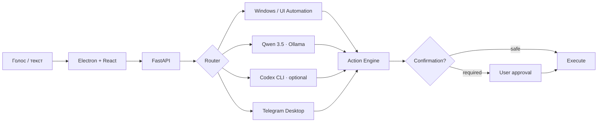

<div align="center">


# Пятница

### Персональный AI-ассистент для Windows

Голосовое управление · Windows automation · анализ экрана · локальный AI · Telegram Desktop


[Возможности](#-возможности) · [Архитектура](#-архитектура) · [Запуск](#-быстрый-старт) · [Команды](COMMANDS.md) · [Документация](#-документация)

</div>

---

**Пятница** — desktop-ассистент, который умеет не только отвечать в чате, но и выполнять действия на компьютере: запускать приложения, работать с окнами и мониторами, анализировать интерфейс, принимать голосовые команды и подготавливать сообщения в Telegram Desktop.

Простые действия выполняются обычным локальным кодом. Для свободных формулировок и vision используется **Qwen 3.5 через Ollama**, а **Codex** можно подключить опционально для сложных планов и анализа экрана.

## ✨ Возможности

| | |
| --- | --- |
| **🎙 Голос**<br>Whisper Large v3 Turbo, активация по слову «Пятница», работа в свёрнутом окне | **🖥 Windows**<br>Приложения, окна, мониторы, громкость, мультимедиа, папки и системные действия |
| **👁 Vision**<br>Анализ окна, выбранного монитора или всех дисплеев | **🧠 Local AI**<br>Qwen 3.5 через Ollama для диалога, планирования и изображений |
| **✈️ Telegram Desktop**<br>Поиск чата, подготовка черновика и отправка только после подтверждения | **🔊 Озвучка**<br>Локальные Qwen3-TTS и Silero |
| **⚡ Каталог команд**<br>90 действий и 1453 опубликованные формулировки | **🛡 Контроль действий**<br>Опасные клики, ввод и клавиши требуют подтверждения |

### Примеры команд

```text
Пятница, открой Discord

Сделай громкость 30 процентов

Открой калькулятор и перенеси его на второй монитор

Что написано в этом окне?

Нажми кнопку «Продолжить»

Напиши @username: буду через десять минут

Пятница, стоп
```

Полный список: **[COMMANDS.md](COMMANDS.md)**.

## 🧩 Архитектура



Модель не получает прямой неограниченный доступ к компьютеру. План проходит валидацию, а действия выполняются существующими Windows-инструментами. Для элементов интерфейса приоритет отдаётся **UI Automation**; vision используется, когда его недостаточно или анализ экрана запрошен напрямую.

## 🧠 Режимы AI

| Режим | Поведение |
| --- | --- |
| **Local only** | Windows-инструменты и Qwen работают локально; облачные AI-запросы отключены |
| **Hybrid** | Простые действия остаются локальными; Codex может использоваться для сложных планов |
| **Codex vision** | Анализ изображения выполняется через Codex, исполнение действий остаётся под контролем приложения |

По умолчанию vision использует **Qwen 3.5 4B**. Codex подключается через официальный CLI и существующий вход ChatGPT; API key приложению не требуется.

> [!IMPORTANT]
> Если для vision выбран Codex, снимок экрана отправляется выбранному облачному провайдеру. В **Local only** этого не происходит.

## 🔒 Основные принципы

- локальный сервис доступен только на `127.0.0.1:17835`;
- записи микрофона не сохраняются в историю;
- потенциально необратимые действия требуют подтверждения;
- Telegram-сценарий не отправляет подготовленный текст без подтверждения;
- `Esc`, кнопка остановки и команда **«Пятница, стоп»** отменяют активную цепочку.

## 🛠 Стек

| Desktop | Backend | AI |
| --- | --- | --- |
| Electron 44 · React 19 · TypeScript · Vite | Python 3.11 · FastAPI · SQLite · UI Automation | Ollama · Qwen 3.5 · Faster Whisper · Vosk · Qwen3-TTS · Silero · Codex CLI |

## 🚀 Быстрый старт

**Требования:** Windows, Node.js + npm, Python 3.11 и Ollama. NVIDIA GPU желательна для ускорения локальных моделей.

```powershell
git clone https://github.com/holy-moly-l/friday-assistant.git
cd friday-assistant

npm install
node node_modules/electron/install.js

python -m venv .venv
.venv\Scripts\python.exe -m pip install --upgrade pip
.venv\Scripts\python.exe -m pip install -r backend\requirements.txt
.venv\Scripts\python.exe -m pip install torch==2.8.0 --index-url https://download.pytorch.org/whl/cpu
.venv\Scripts\python.exe -m pip install -r backend\requirements-gpu.txt

.venv\Scripts\python.exe scripts\download_models.py
.venv\Scripts\python.exe scripts\setup_wake.py

npm run build
npm start
```

Собрать Windows-приложение:

```powershell
npm run package
```

Результат: `release/Friday-win32-x64/Friday.exe`.

Локальные модели, Python-окружения, история разговоров и данные авторизации в Git не публикуются в репозитории.

## ☁️ Codex

Для опционального режима Codex:

```powershell
npm install -g @openai/codex@0.154.0
codex login
codex login status
```

Подробности об изоляции, fallback, таймаутах и vision: **[docs/CODEX.md](docs/CODEX.md)**.

## 🧪 Проверки

```powershell
.venv\Scripts\python.exe -m pytest -q
node tests\electron.cjs
node tests\microphone.cjs
node tests\desktop-native.cjs
node tests\codex-ui.cjs
```

Для версии 1.8 пройдены **448 pytest-тестов и 26 regression-сценариев**, а также реальные проверки Windows capture, vision, Codex и packaged-приложения.

## 📚 Документация

| Раздел | Ссылка |
| --- | --- |
| Все команды | [COMMANDS.md](COMMANDS.md) |
| Управление Windows и Action Engine | [docs/DESKTOP.md](docs/DESKTOP.md) |
| Codex, vision и fallback | [docs/CODEX.md](docs/CODEX.md) |
| История изменений | [CHANGELOG.md](CHANGELOG.md) |
| Сторонние компоненты | [THIRD_PARTY.md](THIRD_PARTY.md) |

---

<div align="center">

**Friday · Personal Intelligence**

*Ассистент, который умеет отвечать, видеть и действовать.*

</div>
