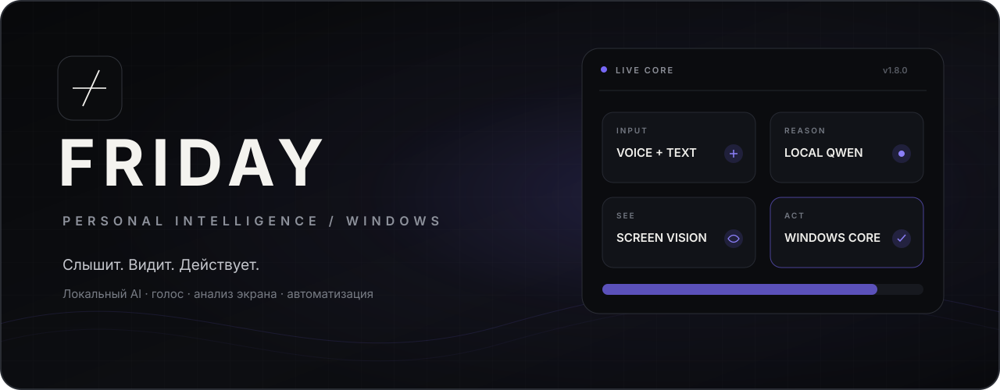
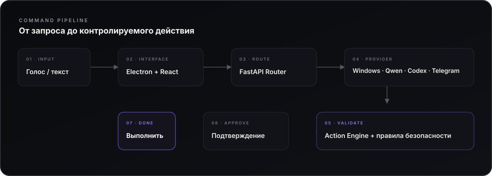

<div align="center">



<br />

### Персональный AI-ассистент, который умеет не только отвечать

Голосовое управление · Windows Automation · анализ экрана · локальный AI · Telegram Desktop

<p>
  
  
  
  
</p>

[Возможности](#возможности) · [Как это работает](#как-это-работает) · [Установка](#быстрый-старт) · [Команды](COMMANDS.md) · [Документация](#документация)

</div>

---

**Пятница** — desktop-ассистент для Windows, который превращает обычную речь в контролируемые действия на компьютере. Он запускает приложения, управляет окнами и мониторами, работает с мультимедиа, анализирует интерфейс и подготавливает сообщения в Telegram Desktop.

Простые команды выполняются локальными инструментами без обращения к модели. Свободные формулировки и vision обрабатывает **Qwen 3.5 через Ollama**; **Codex** можно подключить опционально для сложного планирования и анализа экрана.

## Возможности

<table>
<tr>
<td width="50%" valign="top">

### 🎙 Голос

Whisper Large v3 Turbo, активация по слову «Пятница», работа в свёрнутом окне и мгновенная остановка голосом.

</td>
<td width="50%" valign="top">

### 🖥 Управление Windows

Приложения, окна, мониторы, громкость, мультимедиа, папки и системные действия через единый Action Engine.

</td>
</tr>
<tr>
<td width="50%" valign="top">

### 👁 Анализ экрана

Понимание активного окна, выбранного монитора или всех дисплеев с помощью локального Qwen или Codex vision.

</td>
<td width="50%" valign="top">

### ✈️ Telegram Desktop

Локальная формулировка сообщения от вашего лица, проверка чата и отправка только после подтверждения итогового текста. Есть дословный режим.

</td>
</tr>
<tr>
<td width="50%" valign="top">

### 🧠 Local-first AI

Qwen 3.5 через Ollama для диалога, планирования и vision. Локальная озвучка через Qwen3-TTS или Silero.

</td>
<td width="50%" valign="top">

### ⚡ Каталог команд

**90 действий** и **1 453 опубликованные формулировки**: от простого запуска Discord до цепочек с несколькими окнами.

</td>
</tr>
</table>

<details>
<summary><strong>Посмотреть примеры команд</strong></summary>

```text
Пятница, открой Discord
Сделай громкость 30 процентов
Открой калькулятор и перенеси его на второй монитор
Что написано в этом окне?
Нажми кнопку «Продолжить»
Напиши @username: буду через десять минут
Напиши @username, чтобы он купил хлеб
Напиши @username дословно: я буду в 12
Пятница, стоп
```

Полный каталог находится в **[COMMANDS.md](COMMANDS.md)**.

</details>

## Как это работает

<div align="center">



</div>

Модель не получает прямой неограниченный доступ к компьютеру. План проходит проверку, а действия выполняются существующими Windows-инструментами. Для элементов интерфейса приоритет отдаётся **UI Automation**; vision используется, когда UIA недостаточно или пользователь напрямую просит проанализировать экран.

> [!IMPORTANT]
> Опасные клики, ввод текста, нажатия клавиш и отправка сообщений требуют подтверждения. `Esc`, кнопка остановки и команда **«Пятница, стоп»** отменяют активную цепочку.

## Режимы AI

| Режим | Что происходит |
|:---|:---|
| **Local only** | Windows-инструменты и Qwen работают локально; облачные AI-запросы отключены |
| **Hybrid** | Простые действия остаются локальными; Codex доступен для сложного планирования |
| **Codex vision** | Снимок экрана анализирует Codex, но исполнение по-прежнему контролирует приложение |

По умолчанию vision использует **Qwen 3.5 4B**. Codex подключается через официальный CLI и существующий вход ChatGPT — API key приложению не требуется.

## Приватность и контроль

- backend принимает соединения только на `127.0.0.1:17835`;
- записи микрофона не сохраняются в историю;
- снимок экрана отправляется облачному провайдеру только в облачном vision-режиме;
- Telegram не отправляет подготовленный текст без подтверждения;
- Message Composer использует только локальную Qwen 3.5 4B, без автоматической отправки личных сообщений в облако;
- потенциально необратимые действия проходят отдельную проверку.

## Стек

<div align="center">


</div>

| Desktop | Backend | AI и голос |
|:---|:---|:---|
| Electron 44 · React 19 · TypeScript · Vite | Python 3.11 · FastAPI · SQLite · UI Automation | Ollama · Qwen 3.5 · Faster Whisper · Vosk · Qwen3-TTS · Silero · Codex CLI |

## Быстрый старт

> [!NOTE]
> Нужны Windows 10/11, Node.js + npm, Python 3.11 и Ollama. NVIDIA GPU желательна для ускорения локальных моделей.

```powershell
git clone https://github.com/holy-moly-l/friday-assistant.git
cd friday-assistant

npm install
node node_modules/electron/install.js

python -m venv .venv
.venv\Scripts\python.exe -m pip install --upgrade pip
.venv\Scripts\python.exe -m pip install -r backend\requirements.txt
.venv\Scripts\python.exe -m pip install torch==2.8.0 --index-url https://download.pytorch.org/whl/cpu
.venv\Scripts\python.exe -m pip install -r backend\requirements-gpu.txt

.venv\Scripts\python.exe scripts\download_models.py
.venv\Scripts\python.exe scripts\setup_wake.py

npm run build
npm start
```

<details>
<summary><strong>Собрать самостоятельное Windows-приложение</strong></summary>

```powershell
npm run package
```

Готовая сборка появится в `release/Friday-win32-x64/Friday.exe`.

</details>

<details>
<summary><strong>Подключить опциональный Codex</strong></summary>

```powershell
npm install -g @openai/codex@0.154.0
codex login
codex login status
```

Изоляция, fallback, таймауты и vision подробно описаны в **[docs/CODEX.md](docs/CODEX.md)**.

</details>

## Проверки

Версия 1.8.1 прошла **517 pytest-тестов**, **19 реальных проверок формулировки Qwen**, проверку UI подтверждения и цепочку Telegram в собственном «Избранном»: черновик, отказ, стоп, подтверждённая отправка и проверка истории. Подробнее — в [docs/MESSAGES.md](docs/MESSAGES.md).

Для версии 1.8.0 ранее выполнены 26 regression-сценариев и реальные интеграционные проверки Windows capture, vision, Codex и packaged-приложения.

```powershell
.venv\Scripts\python.exe -m pytest -q
node tests\electron.cjs
node tests\microphone.cjs
node tests\desktop-native.cjs
node tests\codex-ui.cjs
```

## Документация

| Раздел | Документ |
|:---|:---|
| Все голосовые и текстовые команды | **[COMMANDS.md](COMMANDS.md)** |
| Windows Automation и Action Engine | **[docs/DESKTOP.md](docs/DESKTOP.md)** |
| Codex, vision, изоляция и fallback | **[docs/CODEX.md](docs/CODEX.md)** |
| Формулировка и отправка сообщений Telegram | **[docs/MESSAGES.md](docs/MESSAGES.md)** |
| История версий | **[CHANGELOG.md](CHANGELOG.md)** |
| Сторонние компоненты | **[THIRD_PARTY.md](THIRD_PARTY.md)** |

---

<div align="center">


**FRIDAY · PERSONAL INTELLIGENCE**

<sub>Ассистент, который умеет отвечать, видеть и действовать.</sub>

</div>
