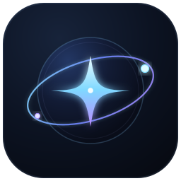
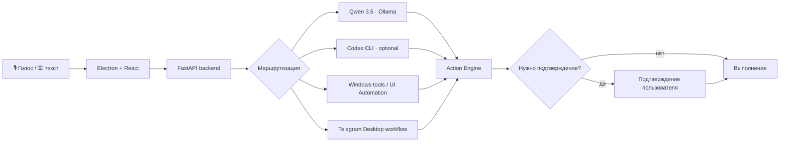

<div align="center">



# Пятница

### Персональный AI-ассистент для Windows

Голос • управление компьютером • анализ экрана • локальный AI • Telegram Desktop

<br />


**Local-first. Облако — только когда вы сами его включаете.**

[Возможности](#-возможности) · [Как это работает](#-как-это-работает) · [Запуск](#-быстрый-старт) · [Команды](COMMANDS.md) · [Codex](docs/CODEX.md) · [Changelog](CHANGELOG.md)

</div>

---

## Что такое Пятница

**Пятница** — desktop-ассистент, который не ограничивается чатом. Она умеет слушать голосовые команды, работать с окнами Windows, понимать содержимое экрана и выполнять действия через проверяемые системные инструменты.

Простые команды выполняются обычным локальным кодом. Для свободных формулировок и анализа изображения можно использовать локальную **Qwen 3.5** через Ollama, а для сложных планов — опциональный **Codex через существующий вход ChatGPT**.

> [!NOTE]
> В режиме **Local only** облачных AI-запросов нет. В Hybrid облачная модель используется только в предусмотренных сценариях, а провайдер анализа экрана выбирается отдельно.

---

## ✨ Возможности

| | | |
| --- | --- | --- |
| **🎙 Голосовое управление**<br>Whisper Large v3 Turbo, wake word «Пятница», работа в свёрнутом окне | **🖥 Управление Windows**<br>Приложения, окна, мониторы, громкость, медиаклавиши, папки и системные действия | **👁 Анализ экрана**<br>Окно, монитор или все дисплеи; Qwen локально или Codex по выбору |
| **🧠 Local AI**<br>Qwen 3.5 через Ollama для диалога, планирования и vision | **✈️ Telegram Desktop**<br>Поиск чата, подготовка сообщения и отправка только после подтверждения | **🔊 Локальная озвучка**<br>Qwen3-TTS и Silero, несколько голосов, остановка и смена тембра |
| **⚡ 90 действий**<br>1453 опубликованные формулировки команд | **🪟 Контекст окон**<br>«открой калькулятор» → «перенеси его на второй монитор» | **🛡 Проверка действий**<br>Опасные клики, ввод текста и клавиши требуют подтверждения |

### Примеры

```text
Пятница, открой Discord

Сделай громкость 30 процентов

Открой калькулятор, перенеси его на второй монитор и разверни

Что написано в этом окне?

Что видно на втором мониторе?

Нажми кнопку «Продолжить»

Напиши Насте: я задержусь на час

Пятница, стоп
```

Полный каталог: **[COMMANDS.md](COMMANDS.md)**.

---

## 🧠 Режимы AI

| Режим | Что происходит |
| --- | --- |
| **Local only** | Локальные Windows-инструменты + Qwen через Ollama. Облачных AI-запросов нет. |
| **Hybrid** | Локальные действия остаются локальными; сложные планы могут использовать Codex. Анализ экрана отдельно переключается между Qwen и Codex. |
| **Codex vision** | Анализ изображения принудительно выполняется через Codex; действия всё равно проходят локальную проверку перед выполнением. |

По умолчанию для анализа изображения используется **Qwen 3.5 4B**.

Codex подключается через официальный CLI и существующий ChatGPT login — API key приложению не нужен. Подробнее: **[docs/CODEX.md](docs/CODEX.md)**.

---

## 🧩 Как это работает



Модель не получает право напрямую «делать что угодно» на компьютере. Она формирует ограниченный план, после чего приложение валидирует шаги и выполняет их через существующие Windows-инструменты.

Для подписанных элементов интерфейса сначала используется **UI Automation**. Vision подключается, когда UIA недостаточно или пользователь прямо просит проанализировать экран.

Подробнее: **[docs/DESKTOP.md](docs/DESKTOP.md)**.

---

## 🔒 Безопасность и приватность

- локальный сервис слушает только `127.0.0.1:17835`;
- локальные режимы STT, TTS, wake word и Qwen не требуют облака;
- записи микрофона не сохраняются в историю — сохраняется распознанный текст;
- debug-логи не должны содержать текст сообщений, значения полей и ответы модели;
- координатные клики и потенциально необратимые действия требуют подтверждения;
- Telegram-сценарий сначала создаёт проверенный черновик и **не отправляет его без подтверждения**;
- после подтверждения vision-цель повторно проверяется на свежем снимке;
- `Esc`, кнопка остановки или команда **«Пятница, стоп»** отменяют активную цепочку.

> [!IMPORTANT]
> Если в Hybrid выбран Codex для анализа экрана, соответствующий снимок отправляется выбранному облачному провайдеру. В Local only этого не происходит.

---

## 🎙 Голосовой стек

| Задача | Технология |
| --- | --- |
| Распознавание речи | **Whisper Large v3 Turbo** |
| Wake word | **Vosk Small RU 0.22** |
| Выразительные голоса | **Qwen3-TTS 0.6B CustomVoice** |
| Быстрые голоса | **Silero v4 RU** |
| Локальный LLM / Vision | **Qwen 3.5** через Ollama |

Доступны выразительные голоса **Serena, Sohee, Ono Anna** и быстрые **Xenia, Baya, Kseniya**.

---

## 🛠 Технологии

**Desktop**

- Electron
- React 19
- TypeScript
- Vite

**Backend**

- Python 3.11
- FastAPI
- SQLite
- UI Automation / Win32 integration

**AI**

- Ollama
- Qwen 3.5
- Faster Whisper
- PyTorch
- Vosk
- Qwen3-TTS
- Silero
- optional OpenAI Codex CLI

---

## 🚀 Быстрый старт

### Требования

- Windows
- Node.js + npm
- Python 3.11
- Ollama
- NVIDIA GPU желательна для ускорения локального STT/TTS

### 1. Клонирование

```powershell
git clone https://github.com/holy-moly-l/friday-assistant.git
cd friday-assistant
```

### 2. Frontend / Electron

```powershell
npm install
node node_modules/electron/install.js
```

### 3. Python environment

```powershell
python -m venv .venv
.venv\Scripts\python.exe -m pip install --upgrade pip
.venv\Scripts\python.exe -m pip install -r backend\requirements.txt
```

Для текущей конфигурации проекта:

```powershell
.venv\Scripts\python.exe -m pip install torch==2.8.0 --index-url https://download.pytorch.org/whl/cpu
.venv\Scripts\python.exe -m pip install -r backend\requirements-gpu.txt
```

### 4. Локальные модели

Установите и запустите Ollama, затем восстановите необходимые модели:

```powershell
.venv\Scripts\python.exe scripts\download_models.py
.venv\Scripts\python.exe scripts\setup_wake.py
```

Локальные веса моделей, Python-окружения, история разговоров и параметры авторизации **не хранятся в Git**.

### 5. Запуск

```powershell
npm run build
npm start
```

Сборка Windows-приложения:

```powershell
npm run package
```

После упаковки исполняемый файл создаётся в:

```text
release/Friday-win32-x64/Friday.exe
```

---

## ☁️ Codex — опционально

Пятница умеет использовать официальный Codex CLI как ограниченный планировщик и vision-провайдер.

Проверенная конфигурация версии 1.8.0 использовала `@openai/codex 0.154.0` и существующий вход ChatGPT.

```powershell
npm install -g @openai/codex@0.154.0
codex login
codex login status
```

Пятница не копирует и не сбрасывает существующую авторизацию Codex. Подробности об изоляции, таймаутах, fallback и реальных замерах находятся в **[docs/CODEX.md](docs/CODEX.md)**.

---

## ✈️ Telegram Desktop

Команды вида:

```text
Напиши Насте привет

Ответь Насте, что я занят

В телеге напиши @username: позвони мне
```

обрабатываются отдельным локальным workflow без Bot API.

Пятница:

1. открывает Telegram Desktop;
2. ищет чат через UI Automation;
3. проверяет получателя;
4. набирает черновик;
5. показывает точный текст;
6. отправляет сообщение только после нажатия **«Отправить сообщение»**.

Если получателя нельзя надёжно проверить, сценарий останавливается.

---

## 🧪 Проверки

Основной набор:

```powershell
.venv\Scripts\python.exe -m pytest -q
node tests\electron.cjs
node tests\microphone.cjs
node tests\desktop-native.cjs
node tests\codex-ui.cjs
```

Для версии 1.8 были пройдены **448 pytest-тестов и 26 regression-сценариев**, а также реальные проверки Windows capture, vision, Codex, Telegram без отправки новых сообщений и packaged-приложения.

---

## 📁 Структура проекта

```text
friday-assistant/
├── backend/        # FastAPI, голос, AI, Windows automation
├── electron/       # Electron main process
├── src/            # React UI
├── shared/         # общий каталог команд
├── scripts/        # setup, диагностика, packaging
├── tests/          # unit + integration + UI regression
├── docs/           # техническая документация
├── public/         # иконка и статические ресурсы
└── package.json
```

---

## 📚 Документация

- **[COMMANDS.md](COMMANDS.md)** — полный каталог команд
- **[docs/DESKTOP.md](docs/DESKTOP.md)** — управление Windows и Action Engine
- **[docs/CODEX.md](docs/CODEX.md)** — Codex, vision, fallback и замеры
- **[CHANGELOG.md](CHANGELOG.md)** — история версий
- **[THIRD_PARTY.md](THIRD_PARTY.md)** — сторонние компоненты и лицензии

---

<div align="center">

### Friday · Personal Intelligence

**Голосовой ассистент, который умеет не только отвечать, но и действовать.**

</div>
